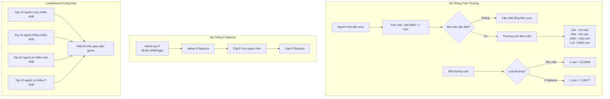

# Cải Tiến Hệ Thống Tính Thưởng

## Tổng quan

Tài liệu này mô tả cải tiến hệ thống tính thưởng cho người chơi trong hệ thống cược xổ số. Sau khi nghiên cứu và phân tích các hệ thống cược thể thao phổ biến toàn cầu, chúng tôi đề xuất một số phương pháp nâng cao trải nghiệm người dùng và tăng tính cạnh tranh của hệ thống.

**Điều chỉnh quan trọng:**
- Số tiền đặt cược càng lớn, tỷ lệ thưởng KHÔNG tăng thêm mà sử dụng hệ thống thưởng cũ (mặc định). Tức là, dù cược lớn hay nhỏ, tỷ lệ trả thưởng không thay đổi theo số tiền cược.
- Số lượng người đặt cược trên cùng một số: Khi nhiều người chơi cùng chọn một số, tỷ lệ thưởng sẽ giảm xuống. Hệ thống sẽ đặt quota (giới hạn) cho mỗi số, khi tổng số tiền đặt cược của các user cho một số đạt đến giới hạn này thì hệ thống sẽ ngừng nhận cược cho số đó và thông báo cho người dùng rằng số tiền nhận cược đã đến giới hạn.
- Tạo hệ thống nhận cược cho mỗi giải theo quota: Hệ thống sẽ thu nhận và tính toán tổng số tiền cược trên mỗi số, mỗi loại hình cược, đảm bảo không vượt quá quota đã định. Nếu quota đạt giới hạn, hệ thống sẽ từ chối các lệnh cược mới cho số đó và trả về thông báo "Số tiền nhận cược cho số này đã đạt giới hạn".

## Hệ thống hiện tại

Hiện tại, hệ thống sử dụng cách tính thưởng đơn giản với tỷ lệ cố định cho từng loại cược:

- **2D**: Tỷ lệ 1:70 (thắng 70 lần tiền cược)
- **3D**: Tỷ lệ 1:600 (thắng 600 lần tiền cược)
- **4D**: Tỷ lệ 1:5000 (thắng 5000 lần tiền cược)
- **Bao lô 2D**: Tỷ lệ 1:70 (thắng 70 lần tiền cược cho mỗi lô)
- **Bao lô 3D**: Tỷ lệ 1:600 (thắng 600 lần tiền cược cho mỗi lô)
- **Bao lô 4D**: Tỷ lệ 1:5000 (thắng 5000 lần tiền cược cho mỗi lô)

Hạn chế của hệ thống hiện tại:
1. Tỷ lệ thưởng cố định không thay đổi theo mức cược
2. Không có hệ thống khuyến khích người chơi đặt cược nhiều hơn
3. Thiếu đa dạng về loại cược và phương thức tính thưởng
4. Không có hệ thống thưởng tích lũy hoặc thưởng trung thành

## Đề xuất cải tiến

### 1. Hệ thống tỷ lệ thưởng động (Dynamic Odds) và Quota cho từng số

- **Số tiền đặt cược càng lớn:** Sử dụng hệ thống thưởng cũ (mặc định)
- **Số lượng người đặt cược trên cùng số:** Khi nhiều người chơi cùng chọn một số, Hệ thống sẽ đặt quota cho mỗi số (hoặc mỗi loại cược), khi tổng số tiền đặt cược cho số đó đạt đến giới hạn thì ngừng nhận cược và thông báo cho người dùng.
- **Cơ chế thu nhận và tính toán tổng cược:** Hệ thống sẽ thu nhận và tính toán tổng số tiền cược trên mỗi số, mỗi loại hình cược, đảm bảo không vượt quá quota đã định. Nếu quota đạt giới hạn, hệ thống sẽ từ chối các lệnh cược mới cho số đó và trả về thông báo "Số tiền nhận cược cho số này đã đạt giới hạn".

```javascript
// Ví dụ pseudo-code kiểm tra quota khi nhận cược
function placeBet(userId, number, betType, amount) {
  const quota = getQuotaForNumber(betType, number);
  const totalBet = getTotalBetForNumber(betType, number);
  if (totalBet + amount > quota) {
    throw new Error('Số tiền nhận cược cho số này đã đạt giới hạn. Vui lòng chọn số khác.');
  }
  // Tiếp tục xử lý đặt cược...
}
```

### 2. Hệ thống Leaderboard

Hệ thống Leaderboard công khai hiển thị trên giao diện game:

- **Top 10 người cược nhiều nhất:** Hiển thị 10 người có tổng số tiền đặt cược cao nhất
- **Top 10 người thắng nhiều nhất:** Hiển thị 10 người có tổng số tiền thắng cao nhất
- **Top 10 người có nhiều coin nhất:** Hiển thị 10 người có số coin cao nhất
- **Top 10 người có nhiều P nhất:** Hiển thị 10 người có số P cao nhất
- **Cập nhật real-time:** Leaderboard được cập nhật theo thời gian thực
- **Không có thưởng trực tiếp:** Leaderboard chỉ để hiển thị và tạo động lực cạnh tranh

### 3. Hệ thống điểm thưởng (Loyalty Points) với mốc đặc biệt

Người chơi tích lũy coin dựa trên hoạt động đặt cược:

- **Tích lũy cơ bản:** 100,000 đồng đặt cược = 1 Coin
- **Mốc đặc biệt:** 
  - Đạt 10 triệu đồng đặt cược: +10 Coin
  - Đạt 50 triệu đồng đặt cược: +50 Coin  
  - Đạt 100 triệu đồng đặt cược: +100 Coin
  - Đạt 1 tỷ đồng đặt cược: +2,000 Coin
- **Đổi thưởng:** Coin có thể đổi thành:
  - Tiền thưởng (1 coin = 10,000đ)
  - P Balance (1 coin = 1,000 P)

### 4. Hệ thống Balance P

- **Đơn vị tiền tệ:** P (Point)
- **Balance cơ bản:** Admin có thể tạo tối đa 100,000,000 P mỗi ngày vào balance của mình
- **Tự động tích lũy:** Hệ thống tự động + coin cho việc tích lũy và đạt mốc đặc biệt
- **Quản lý:** Admin có thể cấp/trừ P cho user bất kỳ
- **Lịch sử:** Theo dõi đầy đủ lịch sử giao dịch P

### 5. Thưởng đặc biệt (Special Rewards)

- **Lucky Number**: Mỗi ngày hệ thống sẽ chọn ngẫu nhiên một số "may mắn", nếu người chơi đặt cược vào số này và thắng, sẽ được nhân đôi tiền thưởng
- **Birthday Bonus**: Tăng 20% tiền thưởng cho các cược thắng vào ngày sinh nhật người chơi
- **Milestone Rewards**: Thưởng đặc biệt khi đạt các cột mốc: lần cược thứ 100, 500, 1000...

### 5. Cược Jackpot tích lũy (Progressive Jackpot)

Mỗi cược sẽ đóng góp một phần nhỏ (0.5%) vào quỹ Jackpot. Người chơi có thể thắng Jackpot khi:

- Đặt cược tối thiểu 100,000 đồng
- Chọn đúng số đặc biệt
- Cộng thêm một điều kiện phụ (như đặt cược trong khung giờ vàng)

## Các yêu cầu kỹ thuật

### 1. Thay đổi cấu trúc cơ sở dữ liệu

```javascript
// Cập nhật User Model
const UserSchema = new Schema({
  // Các trường hiện có
  // ...
  totalBetAmount: {
    type: Number,
    default: 0
  },
  // Đã hủy bỏ currentTier vì thay bằng Leaderboard
  loyaltyPoints: {
    type: Number,
    default: 0
  },
  // Theo dõi các mốc đặt cược đã đạt được (10tr, 50tr, 100tr)
  achievedMilestones: {
    type: [Number],
    default: []
  },
  lastBetDate: {
    type: Date
  }
});
```

### 2. Cập nhật hệ thống tính thưởng

```javascript
// Trong lotteryService.js
async function calculateWinAmount(bet, result) {
  let baseAmount = 0;
  
  // Tính tiền thắng cơ bản
  switch(bet.betType) {
    case '2D':
      baseAmount = bet.amount * config.payoutRatios['2D'];
      break;
    case '3D':
      baseAmount = bet.amount * config.payoutRatios['3D'];
      break;
    // Thêm các loại cược khác
  }
  
  // Áp dụng tỷ lệ thưởng động
  const dynamicFactor = await calculateDynamicOddsFactor(bet);
  baseAmount *= dynamicFactor;
  
  // Áp dụng các loại thưởng đặc biệt
  const specialBonuses = await calculateSpecialBonuses(bet, user);
  baseAmount *= (1 + specialBonuses);
  
  // Làm tròn và trả về kết quả
  return Math.floor(baseAmount);
}
```

### 3. API Endpoint mới

```javascript
// Trong routes/api.js
router.get('/rewards/loyalty-points', authMiddleware, userController.getLoyaltyPoints);
router.post('/rewards/redeem-points', authMiddleware, userController.redeemLoyaltyPoints);
router.get('/rewards/leaderboard', rewardController.getLeaderboardInfo);
router.get('/rewards/leaderboard/betting', rewardController.getTopBettingLeaderboard);
router.get('/rewards/leaderboard/winning', rewardController.getTopWinningLeaderboard);
router.get('/rewards/jackpot', betController.getCurrentJackpot);

// Coin và Balance APIs
router.get('/coins/balance', authMiddleware, coinController.getUserCoinBalance);
router.get('/coins/p-balance', authMiddleware, coinController.getUserPBalance);
router.get('/coins/history', authMiddleware, coinController.getUserCoinHistory);
router.get('/coins/p-history', authMiddleware, coinController.getUserPHistory);
router.get('/coins/top-holders', coinController.getTopCoinHolders);
router.get('/coins/top-p-holders', coinController.getTopPHolders);

// Admin Coin và Balance APIs
router.post('/admin/coins/grant', authMiddleware, adminAuth, coinController.adminGrantCoins);
router.post('/admin/coins/deduct', authMiddleware, adminAuth, coinController.adminDeductCoins);
router.post('/admin/p/grant', authMiddleware, adminAuth, coinController.adminGrantP);
router.post('/admin/p/deduct', authMiddleware, adminAuth, coinController.adminDeductP);
router.get('/admin/coins/stats', authMiddleware, adminAuth, coinController.getSystemStats);
router.post('/admin/coins/initialize-daily-bonus', authMiddleware, adminAuth, coinController.initializeDailyBonus);
```

## Kế hoạch triển khai

### Giai đoạn 1: Thiết kế và chuẩn bị (2 tuần)
- Thiết kế chi tiết các tính năng mới
- Cập nhật schema cơ sở dữ liệu
- Cập nhật tài liệu API

### Giai đoạn 2: Phát triển (4 tuần)
- Phát triển hệ thống tỷ lệ thưởng động
- Xây dựng hệ thống phân cấp người chơi
- Triển khai hệ thống điểm thưởng
- Phát triển cược kết hợp

### Giai đoạn 3: Kiểm thử (2 tuần)
- Kiểm thử đơn vị và tích hợp
- Kiểm thử hiệu năng
- Kiểm thử chấp nhận người dùng

### Giai đoạn 4: Ra mắt (1 tuần)
- Triển khai lên môi trường staging
- Kiểm tra cuối cùng
- Triển khai lên production
- Theo dõi và hỗ trợ

## Kết luận

Các cải tiến này sẽ giúp:
- Tăng sự hấp dẫn của hệ thống đối với người chơi thông qua hệ thống leaderboard công khai
- Khuyến khích người chơi đặt cược nhiều hơn để tích lũy coin và đạt các mốc thưởng đặc biệt
- Tạo ra hệ thống kinh tế trong game với coin và P balance
- Tăng tính cạnh tranh thông qua việc hiển thị xếp hạng người chơi
- Tạo ra lợi thế cạnh tranh so với các nền tảng cược khác
- Tăng doanh thu và lợi nhuận cho hệ thống

Với việc áp dụng hệ thống quota, leaderboard công khai, và hệ thống coin/P balance, hệ thống của chúng ta sẽ trở nên hấp dẫn hơn và có khả năng cạnh tranh cao hơn trên thị trường. 

## Lưu ý về các tính năng đã loại bỏ

Các tính năng thưởng khuyến khích (Incentive Bonuses) sau đây đã được loại bỏ:

- **First-time Bonus**: Thưởng thêm 10% cho lần thắng đầu tiên của người chơi mới
- **Comeback Bonus**: Thưởng thêm 5% nếu người chơi thắng sau chuỗi thua 5 lần liên tiếp
- **Big Win Bonus**: Thưởng thêm 3% cho các khoản thắng lớn (trên 10,000,000)
- **Daily Streak Bonus**: Thưởng thêm 1% mỗi ngày liên tiếp đặt cược, tối đa 7%

Các tính năng đổi thưởng sau đây cũng đã được loại bỏ:

- **Cược miễn phí**: Đổi 1 coin lấy 50,000đ cược miễn phí
- **Tăng tỷ lệ thắng cược**: Đổi 1 coin lấy 5% tăng tỷ lệ thắng

Các tính năng và mô hình khác đã loại bỏ:

- **Hệ thống Tier Bonus**: Đã loại bỏ hoàn toàn mô hình `BetTier` và các hàm liên quan như `getBetTiers()`. Thay thế bằng hệ thống Leaderboard công khai.
- **Parlay/Combo Bonus**: Đã loại bỏ tính năng thưởng cho cược kết hợp (do đã có xiên 2-5).

Các tính năng này đã được loại bỏ để đơn giản hóa hệ thống tính thưởng và tập trung vào các tính năng quan trọng hơn như hệ thống quota, leaderboard công khai, và hệ thống coin/P balance.

---

## Hướng dẫn tìm đến các file thực hiện cơ chế thưởng

Để tham khảo hoặc chỉnh sửa logic tính thưởng, bonus, loyalty, leaderboard, hãy xem các file sau trong thư mục backend:

- **Cơ chế tính thưởng tổng quát, thưởng động, thưởng đặc biệt, loyalty:**
  - `services/rewardService.js`: Toàn bộ logic tính thưởng nâng cao, dynamic odds, special bonus, jackpot, loyalty points, leaderboard.
  - `models/User.js`: Định nghĩa các trường liên quan đến thưởng, loyalty, achievedMilestones cho user.

- **Cơ chế tính thưởng khi xử lý kết quả xổ số:**
  - `services/lotteryService.js`: Xử lý kiểm tra kết quả, xác định thắng/thua, gọi rewardService để tính thưởng, gửi thông báo Telegram.
  - `services/resultService.js`: Xử lý cập nhật kết quả, tính thưởng cho các cược liên quan.
  - `controllers/resultController.js`: API thêm/lấy kết quả, gọi lotteryService để xử lý thưởng.

- **API quản lý trả thưởng, phê duyệt thưởng:**
  - `controllers/payoutController.js`: Các API lấy danh sách cược thắng, tạo/yêu cầu/phê duyệt trả thưởng.

- **API quản lý thưởng và leaderboard:**
  - `controllers/rewardController.js`: Các API quản lý loyalty points, leaderboard, jackpot.

- **Các file liên quan khác:**
  - `config/`: Cấu hình payoutRatios, bonus, các tham số thưởng.
  - `services/userService.js`: Cập nhật điểm thưởng, lịch sử thưởng cho user.

> Để hiểu rõ từng loại thưởng, hãy bắt đầu từ `services/rewardService.js` và theo dõi các hàm được gọi từ `lotteryService.js` khi xử lý kết quả. 

Hướng dẫn sử dụng:
1. Cấu hình Redis:
  PUT /api/admin/config/quota/redis
Body: {
  "enabled": true,
  "host": "localhost",
  "port": 6379
}

2. Kiểm tra kết nối Redis:
GET /api/admin/config/quota/redis/test

3. Cấu hình phát hiện bất thường:
PUT /api/admin/config/quota/anomaly
Body: {
  "maxBetsPerDay": 100,
  "maxDailyAmount": 50000000
}

4. Xem Leaderboard (API công khai - không cần xác thực):
GET /api/rewards/leaderboard
GET /api/rewards/leaderboard/betting
GET /api/rewards/leaderboard/winning

5. Xem điểm thưởng:
GET /api/rewards/loyalty-points

6. Đổi coin thành phần thưởng:
POST /api/rewards/redeem-points
Body: { "rewardType": "cash", "coins": 10 }
Hoặc: { "rewardType": "p_balance", "coins": 10 }

7. Xem Coin Balance:
GET /api/coins/balance
GET /api/coins/history

8. Xem P Balance:
GET /api/coins/p-balance
GET /api/coins/p-history

9. Xem Top Holders (API công khai - không cần xác thực):
GET /api/coins/top-holders
GET /api/coins/top-p-holders

10. Admin quản lý Coin và P:
POST /api/admin/coins/grant
Body: { "userId": "user_id", "amount": 100, "reason": "Thưởng đặc biệt" }

POST /api/admin/coins/deduct
Body: { "userId": "user_id", "amount": 50, "reason": "Phạt vi phạm" }

POST /api/admin/p/grant
Body: { "userId": "user_id", "amount": 10000, "reason": "Thưởng P" }

POST /api/admin/p/deduct
Body: { "userId": "user_id", "amount": 5000, "reason": "Trừ P" }

11. Admin thống kê và khởi tạo:
GET /api/admin/coins/stats

12. Admin tạo P hàng ngày (tối đa 100M P/ngày):
POST /api/admin/coins/initialize-daily-bonus

## Sơ đồ luồng hệ thống tính thưởng



## Các API đã cập nhật

### 1. Loại bỏ các API không còn sử dụng
- Đã loại bỏ API liên quan đến "free_bet" và "odds_boost" trong hệ thống đổi thưởng
- Chỉ giữ lại các phần thưởng "cash" và "p_balance"

### 2. Cập nhật API khởi tạo daily bonus
- `POST /api/admin/coins/initialize-daily-bonus`: Đã thay đổi để admin có thể tạo tối đa 100M P mỗi ngày vào balance của mình, thay vì tự động cấp cho system balance

### 3. Cập nhật API leaderboard và top holders
- Các API leaderboard và top holders đã được cập nhật để truy cập công khai (không cần xác thực)
- `GET /api/rewards/leaderboard`: Xem thông tin leaderboard tổng hợp
- `GET /api/rewards/leaderboard/betting`: Xem top 10 người cược nhiều nhất
- `GET /api/rewards/leaderboard/winning`: Xem top 10 người thắng nhiều nhất
- `GET /api/coins/top-holders`: Xem top 10 người có nhiều coin nhất
- `GET /api/coins/top-p-holders`: Xem top 10 người có nhiều P nhất

### 4. Cải thiện hiển thị dữ liệu
- Đã cải thiện cách hiển thị thông tin người dùng trong leaderboard và top holders
- Đã thêm xếp hạng (rank) cho mỗi người dùng trong danh sách
- Đã ẩn thông tin nhạy cảm, chỉ hiển thị thông tin công khai 

